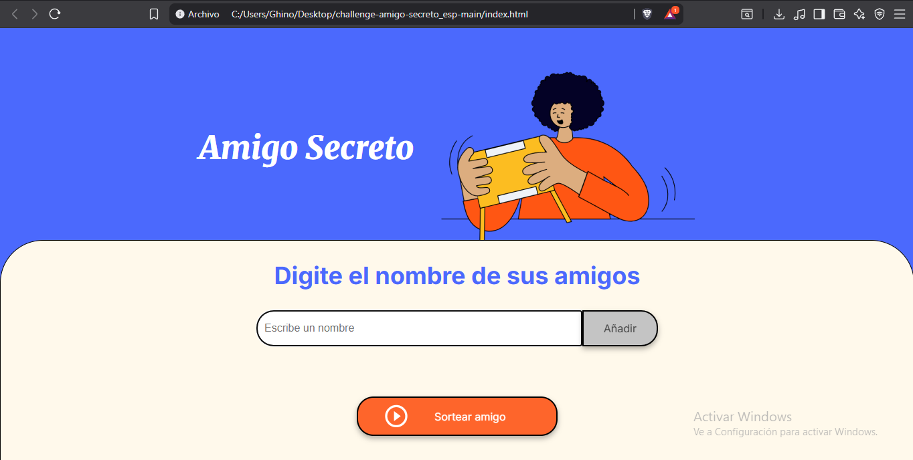
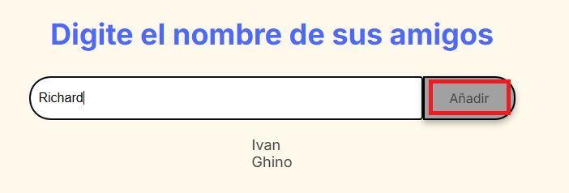
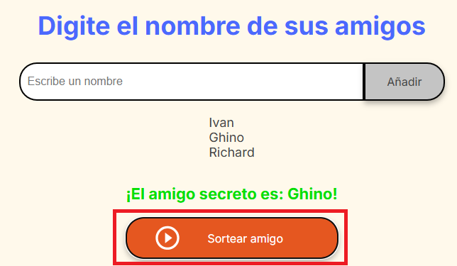

# Amigo Secreto 

Este es un proyecto simple que te permite organizar un sorteo de "Amigo Secreto". La aplicación permite a los usuarios agregar nombres a una lista y, con un solo clic, sortear de forma aleatoria quién es el amigo secreto seleccionado.

El objetivo principal de este desafío es fortalecer las habilidades de **lógica de programación en JavaScript**, manipulando arrays, validando datos y actualizando dinámicamente el DOM (Document Object Model).

## Funcionalidades ✨

* **Agregar Nombres**: Ingresa el nombre de cada amigo en el campo de texto y haz clic en el botón "Añadir".
* **Validación de Entrada**: Si el campo de texto está vacío, se mostrará una alerta para asegurar que se ingrese un nombre válido.
* **Visualizar Lista**: A medida que añades nombres, estos se muestran en una lista en la página.
* **Sorteo Aleatorio**: Al presionar el botón "Sortear amigo", la aplicación selecciona un nombre de la lista de forma completamente aleatoria y lo muestra en pantalla.

## Cómo Usar el Proyecto 🚀

1.  **Clona el repositorio**:
    ```bash
    git clone [https://github.com/sindresorhus/del](https://github.com/sindresorhus/del)
    ```

2.  **Abre el archivo `index.html`**:
    Abre el archivo `index.html` en tu navegador web. No se necesita ningún servidor local.
    

3.  **Añade Nombres**:
    Escribe los nombres de los participantes en el campo de texto y haz clic en "Añadir".
    

4.  **Realiza el Sorteo**:
    Cuando todos los nombres estén en la lista, haz clic en el botón "Sortear amigo" y descubre al afortunado.
    

## Tecnologías Utilizadas 🛠️

* **HTML**: Para la estructura de la página.
* **CSS**: Para los estilos y la interfaz de usuario.
* **JavaScript**: Para la lógica del sorteo, la manipulación del DOM y las validaciones.

---
